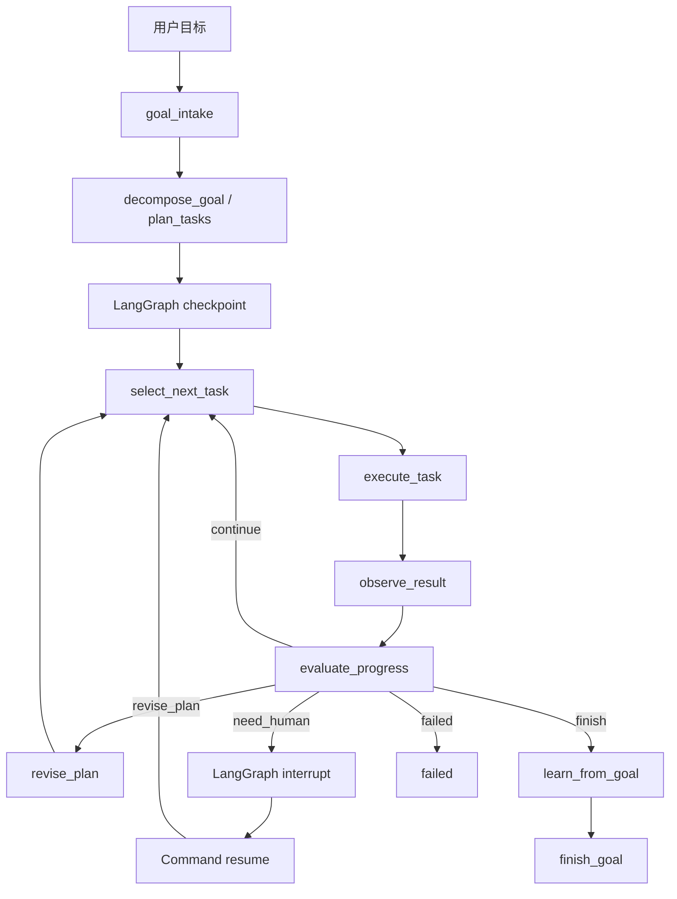

# MonkeyAgent Harness-style Agent 说明文档

本文档说明 MonkeyAgent 如何作为一个类 Harness Agent 的本地个人助理：用户给出目标后，Agent 能拆解任务、探索能力、调用工具、生成新工具、等待确认、恢复执行，并把可复用经验沉淀到个人 workspace。

MonkeyAgent 当前定位是：**单人独立部署的 Rules-first、自学习、自进化个人助理 Agent**。它不做多租户隔离；隔离通过独立安装目录或不同 `MONKEY_AGENT_RUNTIME_DIR` 实现。

## 1. 核心定位

MonkeyAgent 有两条主路径：

```text
Ask  路径：回答一个问题，适合即时问答和轻量任务。
Goal 路径：完成一个目标，适合多步骤探索、工具生成、验证和沉淀。
```

类 Harness Agent 的能力主要体现在 Goal 路径：

```text
给定目标
-> 自动拆解任务 DAG
-> 探索已有 Rules / Skills / Tools
-> 缺工具时进入 Tool Builder
-> 执行低风险步骤
-> 高风险或写操作触发 interrupt
-> 用户确认后 resume
-> 评估结果
-> 生成 pending learning candidate
```

## 2. Harness-style Goal Engine

Goal Engine 用于处理更大的目标，例如：

- “帮我接入飞书机器人，支持给指定群发送消息，并沉淀成可复用能力。”
- “帮我调研一个 SaaS API，并生成可复用工具。”
- “我作为销售明天拜访甲方，帮我准备一个行动方案。”
- “帮我完成一个目标，并记录执行过程、证据和学习候选。”

整体流程：



## 3. LangGraph Checkpoint / Interrupt / Resume

Goal Engine 已接入 LangGraph `StateGraph`。

关键规则：

- `goal_id` 同时作为 LangGraph `thread_id`。
- checkpoint 是目标执行状态的主真相。
- `.monkey_agent/personal/goals/<goal_id>/` 是可读投影，用于 CLI/API 查看状态、任务、事件、证据和评估。
- 安装 `langgraph-checkpoint-sqlite` 后，checkpoint 使用 SQLite 存储。
- 未安装 SQLite checkpointer 时，自动 fallback 到 memory checkpointer，方便本地开发。

运行时目录：

```text
.monkey_agent/personal/goals/
  checkpoints.sqlite
  <goal_id>/
    goal.yaml
    tasks.yaml
    events.jsonl
    evaluations.jsonl
    evidence/
    artifacts/
    learnings/
```

典型返回字段：

```json
{
  "goal_id": "goal_xxx",
  "thread_id": "goal_xxx",
  "checkpointed": true,
  "checkpoint_backend": "sqlite",
  "interrupted": false,
  "resume_required": false,
  "interrupt_payload": null,
  "last_checkpoint": "...",
  "execution_path": []
}
```

当目标涉及外部写操作、真实消息发送、启用 confirm 工具或正式沉淀时，Goal Engine 会触发 interrupt：

```json
{
  "status": "waiting_human",
  "interrupted": true,
  "resume_required": true,
  "interrupt_payload": {
    "goal_id": "goal_xxx",
    "task_id": "task_005",
    "message": "任务需要用户确认后继续。",
    "risk": "medium"
  }
}
```

用户确认后：

```bash
python3 -m monkey_agent goal step <goal_id> --confirm
```

底层使用 LangGraph `Command(resume={"approved": true})` 恢复同一个 checkpoint thread。

## 4. 能力优先级

Goal 子任务复用 Ask 路径的能力体系，优先级如下：

```text
personal Rules
-> global Rules
-> personal YAML Skills / Agent Skills
-> global YAML Skills
-> personal Generated Tools
-> global Generated Tools / Built-in Tools
-> Tool Builder
-> Web Search / LLM Reasoning
-> Human Confirmation
-> Pending Review
```

含义：

- 确定性任务优先用 Rules。
- 方法论任务优先用 Skills。
- 外部查询优先用 Tool / Web Search。
- 已有工具不足时进入 Tool Builder。
- 低风险只读能力可自动执行。
- 写操作和高风险动作必须确认。

## 5. Task DAG

Goal Planner 会把目标拆成任务 DAG。每个任务包含：

```json
{
  "task_id": "task_001",
  "title": "搜索公开资料和接口线索",
  "type": "research",
  "executor": "research",
  "status": "pending",
  "depends_on": [],
  "risk": "low",
  "requires_confirmation": false,
  "acceptance_criteria": [],
  "output": {},
  "evidence": []
}
```

任务 executor 包括：

```text
ask
research
tool_builder
validation
learning
human_confirm
```

调度策略：

- 只执行依赖已完成的 pending task。
- 多个 ready task 时，低风险优先。
- 同风险下按 priority 和 task_id 排序。
- 每次 `goal step` 最多推进当前 goal 的 `max_steps` 限制。
- 每个节点执行后都会 checkpoint，并刷新 projection。

## 6. Tool Builder 自进化链路

当目标需要新能力，而现有 Rules / Skills / Tools 不足时，Goal Engine 会进入 Tool Builder。

链路：

```text
discover_tool_spec
-> draft_tool_code
-> validate_tool_code
-> sandbox_test_tool
-> register_generated_tool
-> learn_generated_tool
```

安全策略：

- 静态检查禁止危险 import、shell 执行、删除文件、任意 eval/exec。
- dry-run 通过后才允许注册 generated tool。
- 只读低风险工具可自动启用。
- 写操作工具注册为 `permission=confirm`。
- Tool Run Trace 不保存完整生成代码正文，只保存摘要和路径。

生成工具默认写入：

```text
.monkey_agent/personal/generated_tools/
.monkey_agent/personal/generated_tools.yaml
```

## 7. Evaluation 机制

Evaluation 是 Goal Engine 的安全闸门。

它检查：

- task 是否完成。
- acceptance criteria 是否满足。
- 是否有工具失败但被隐藏。
- 是否命中 Counterexamples。
- 是否涉及外部写操作。
- 是否需要人工确认。
- 是否需要修正计划。
- 是否值得沉淀为 Rule / Skill / Memory / Counterexample。

Evaluation 结果会写入：

```text
.monkey_agent/personal/goals/<goal_id>/evaluations.jsonl
```

同时会进入 Run Trace。

## 8. Learning 闭环

Goal 完成或子任务执行后，会根据结果判断是否产生学习候选：

```text
稳定 API / 工具调用 / 公式 / 固定口径
-> pending Rule

可复用流程 / 操作方法 / 分析模板
-> pending Skill

用户偏好 / 常用格式 / 个人习惯
-> pending Memory

失败判断 / 错误工具 / 错误路由
-> pending Counterexample

可执行新能力
-> Generated Tool + pending Rule
```

学习默认只进入 pending review，不会自动正式生效。

常用命令：

```bash
python3 -m monkey_agent review list
python3 -m monkey_agent adopt <candidate_id>
python3 -m monkey_agent review approve <candidate_id>
python3 -m monkey_agent review reject <candidate_id>
```

## 9. Run Trace

每次 Ask、Goal、Tool Builder 都会写 Run Trace：

```text
.monkey_agent/personal/runs/
  ask/
  goals/
  tools/
```

Goal Run 记录：

- 输入目标。
- goal_id / thread_id。
- execution_path。
- task DAG 摘要。
- tools / tool_builder 摘要。
- evaluation 摘要。
- learning_candidate_ids。
- errors。
- answer_preview。

常用命令：

```bash
python3 -m monkey_agent runs list --type goal
python3 -m monkey_agent runs latest --type goal
python3 -m monkey_agent runs inspect <run_id>
```

## 10. CLI 使用示例

创建目标：

```bash
python3 -m monkey_agent goal start "我作为销售明天拜访甲方，帮我准备一个行动方案" --max-steps 1
```

推进目标：

```bash
python3 -m monkey_agent goal step <goal_id>
```

查看计划：

```bash
python3 -m monkey_agent goal plan <goal_id>
```

查看事件和 checkpoint 摘要：

```bash
python3 -m monkey_agent goal events <goal_id>
```

暂停 / 恢复：

```bash
python3 -m monkey_agent goal pause <goal_id>
python3 -m monkey_agent goal resume <goal_id>
```

确认 interrupt：

```bash
python3 -m monkey_agent goal step <goal_id> --confirm
```

验证飞书类写操作目标：

```bash
python3 -m monkey_agent goal start "帮我接入飞书机器人，支持给指定群发送消息，并沉淀成可复用能力。" --max-steps 5
python3 -m monkey_agent goal step <goal_id>
python3 -m monkey_agent goal step <goal_id> --confirm
```

## 11. API 使用示例

创建目标：

```http
POST /v1/goals
```

```json
{
  "goal": "帮我接入飞书机器人，支持给指定群发送消息，并沉淀成可复用能力。",
  "context": {},
  "max_steps": 5,
  "force_learning": true
}
```

推进目标：

```http
POST /v1/goals/{goal_id}/step
```

```json
{
  "confirm": false
}
```

确认继续：

```http
POST /v1/goals/{goal_id}/step
```

```json
{
  "confirm": true
}
```

查看目标：

```http
GET /v1/goals/{goal_id}
GET /v1/goals/{goal_id}/plan
GET /v1/goals/{goal_id}/events
```

## 12. 当前边界

当前版本不做：

- 后台并发任务执行。
- 多租户隔离。
- 自动执行外部写操作。
- 自动 approve pending review。
- Docker 级代码沙箱。
- 完整网页 Trace Viewer。

当前版本已经支持：

- LangGraph Goal StateGraph。
- checkpoint / interrupt / resume。
- Task DAG。
- Tool Builder 自进化。
- Evaluation 安全闸门。
- Run Trace。
- personal workspace 学习沉淀。

## 13. 快速验收清单

执行：

```bash
python3 -m compileall monkey_agent tests
python3 -m unittest discover -s tests
```

期望：

```text
Ran 71 tests
OK
```

手工验证：

```bash
python3 -m monkey_agent goal start "我作为销售明天拜访甲方，帮我准备一个行动方案" --max-steps 1
python3 -m monkey_agent goal step <goal_id>
python3 -m monkey_agent goal events <goal_id>
python3 -m monkey_agent runs latest --type goal
```

检查点：

- `goal step` 分步执行时，未完成目标的 `next_action` 应是 `continue`，不应暴露内部 `done` 哨兵。
- `goal events` 中能看到 `checkpoint_backend`。如果是 `memory`，只能做当前进程内测试；如果是 `sqlite`，可以跨进程恢复。
- 删除 projection 中的 `goal.yaml` 或 `tasks.yaml` 后，下一次 `goal status` / `goal step` 应从 checkpoint 重建可读文件。

写操作 interrupt 验证：

```bash
python3 -m monkey_agent goal start "帮我接入飞书机器人，支持给指定群发送消息，并沉淀成可复用能力。" --max-steps 5
python3 -m monkey_agent goal step <goal_id>
python3 -m monkey_agent goal step <goal_id> --confirm
```

Tool Builder 收口验证：

```bash
python3 -m monkey_agent ask "我作为乙方软件公司的销售，明天要去拜访甲方，我应该准备什么？"
python3 -m monkey_agent ask "今天上海天气怎么样？"
python3 -m monkey_agent ask "明天合肥天气怎么样？"
python3 -m monkey_agent runs latest --type tool
```

期望：

- 销售拜访问题走个人助理建议路径，不进入 `draft_tool_code`。
- 天气问题在没有已注册天气工具时可以生成可复用天气能力，后续不同城市/日期优先复用生成工具。
- Tool Run Trace 不包含完整生成代码，也不泄露危险代码片段；只保留阶段、安全检查摘要、dry-run 摘要和 evaluation。
