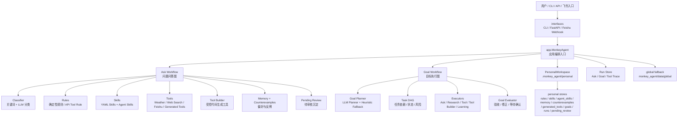
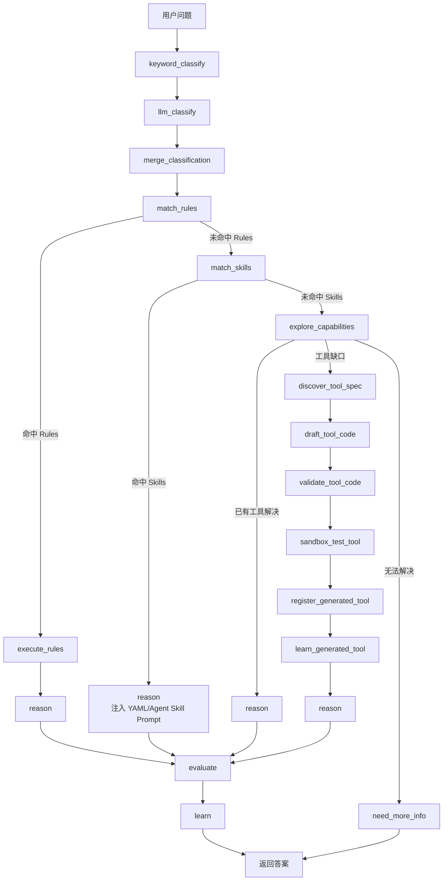
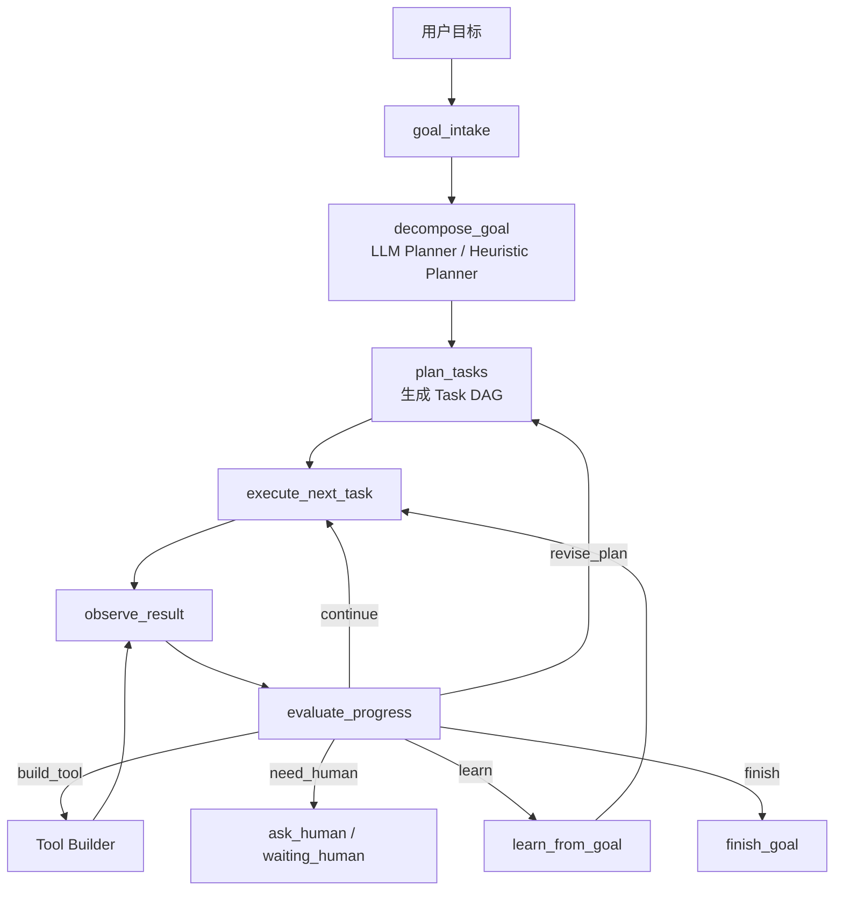

# MonkeyAgent 架构与功能测试手册

本文档用于保存当前 MonkeyAgent 的完整架构说明、核心能力边界和手工测试用例。

MonkeyAgent 当前定位是：**单人独立部署的 Rules-first、自学习、自进化个人助理 Agent**。系统不提供多租户隔离，不暴露用户切换语义；独立隔离通过不同部署目录或不同 `MONKEY_AGENT_RUNTIME_DIR` 实现。

## 1. 总体架构



## 2. 运行时与能力优先级

当前运行时目录：

```text
.monkey_agent/
  personal/
    rules/
    skills/
    agent_skills/
    agent_skills.yaml
    memory/
    counterexamples/
    generated_tools/
    generated_tools.yaml
    goals/
    pending_review/
      rules/
      skills/
      memory/
      counterexamples/
  global/
    generated_tools/
    generated_tools.yaml
```

内置全局基础能力来自：

```text
monkey_agent/data/global/
  rules/
  skills/
  memory/
  counterexamples/
```

执行优先级：

```text
personal Rules
-> global Rules
-> personal YAML Skills / Agent Skills
-> global YAML Skills
-> personal Generated Tools
-> global Generated Tools / Built-in Tools
-> Tool Builder
-> General LLM Reasoning / Human Clarification
-> Pending Review / Learning
```

## 3. Ask 问答流程



核心原则：

- Rules 输出是确定事实，模型不得覆盖。
- Skills 只提供方法论、步骤、模板或上下文注入。
- Agent Skills 读取 `SKILL.md`，保留 `scripts/`、`references/`、`assets/`，但 v1 不自动执行脚本。
- Tool Builder 只在现有能力不足时进入，生成工具必须经过静态安全检查和 dry-run。
- 新沉淀内容默认进入 `pending_review`，需要 `adopt` 或 `review approve` 后才正式生效。

## 4. Goal Engine 目标执行流程



Goal Engine 适合较大的目标，例如：

- “帮我接入飞书机器人发送消息能力。”
- “帮我调研某个 API，并沉淀成可复用工具。”
- “帮我准备销售拜访甲方的行动方案。”
- “帮我分析资料、形成任务拆解并保留执行轨迹。”

每个 Goal 会写入：

```text
.monkey_agent/personal/goals/<goal_id>/
  goal.yaml
  tasks.yaml
  events.jsonl
  evaluations.jsonl
  evidence/
  artifacts/
  learnings/
```

## 5. 功能说明

### 5.1 Rules

Rules 用于确定性能力，包括：

- 百分比、基础四则运算、日期推算、单位换算等可验证计算。
- 固定业务口径。
- 图表规则。
- 已审核 API Tool Rule。
- 已沉淀 Generated Tool 的调用规则。

基础常识问题不作为单问单答 Rule 库维护；没有固定业务口径时，MonkeyAgent 应走 LLM 常识回答，并避免返回“字段定义/API 配置”类澄清模板。

常规问题路由由 Routing Policy 统一护航：确定性基础问题走 Rules，常识/建议问题走 LLM 或 Skills，外部实时信息走 Tools/Search，只有缺数据、缺口径、缺鉴权或工具失败时才进入 `need_more_info`。

典型命令：

```bash
python3 -m monkey_agent rules list
```

### 5.2 YAML Skills

YAML Skills 是轻量 Prompt 技能，适合：

- 写作模板。
- 分析框架。
- 报告结构。
- 通用个人助理建议方法。

典型命令：

```bash
python3 -m monkey_agent skills list --type yaml
```

### 5.3 Agent Skills

Agent Skills 是标准 `SKILL.md` 技能包，面向 skills.sh / Agent Skills 生态。

目录结构：

```text
my-skill/
  SKILL.md
  scripts/
  references/
  assets/
```

安装与管理：

```bash
python3 -m monkey_agent skills install vercel-labs/skills --skill find-skills
python3 -m monkey_agent skills install vercel-labs/skills/find-skills
python3 -m monkey_agent skills import ./my-skill
python3 -m monkey_agent skills list --type agent
python3 -m monkey_agent skills inspect find-skills
python3 -m monkey_agent skills disable find-skills
python3 -m monkey_agent skills enable find-skills
python3 -m monkey_agent skills remove find-skills
```

安全边界：

- 必须存在 `SKILL.md`。
- `SKILL.md` 必须包含 YAML frontmatter。
- `name` 必须是小写字母、数字和短横线，且等于目录名。
- v1 不自动执行 `scripts/`。
- `allowed-tools` 只作为 metadata，不自动授权。

### 5.4 Memory 与 Counterexamples

Memory 记录用户偏好，例如：

- “以后默认用表格输出。”
- “报告先给结论，再给依据。”

Counterexamples 记录错误案例，例如：

- NBA 问题不能误走天气规则。
- 不要只说“已按 Skill 执行”，要输出实际内容。

典型命令：

```bash
python3 -m monkey_agent memory list
python3 -m monkey_agent counterexamples list
```

### 5.5 Built-in Tools

当前内置工具包括：

- Weather：天气查询，基于 Open-Meteo。
- Web Search：公开信息搜索。
- Feishu：飞书消息发送能力草案与 API 支持。

典型命令：

```bash
python3 -m monkey_agent tools list
```

### 5.6 Tool Builder

当 Rules、Skills、Tools 都无法解决问题时，Tool Builder 尝试：

```text
发现工具规格
-> 生成 Python Tool 代码
-> 静态安全检查
-> dry-run 测试
-> 注册 Generated Tool
-> 生成 pending Rule
```

低风险只读工具可自动启用；写操作和中高风险工具需要确认。

典型命令：

```bash
python3 -m monkey_agent tools generated list
python3 -m monkey_agent tools generated inspect <tool-id>
python3 -m monkey_agent tools generated test <tool-id>
```

### 5.7 Learning / Review

学习内容默认不会直接生效，而是进入：

```text
.monkey_agent/personal/pending_review/
```

通过以下方式正式采用：

```bash
python3 -m monkey_agent review list
python3 -m monkey_agent review approve <candidate-id>
python3 -m monkey_agent adopt <candidate-id>
```

也支持对话中回复：

```bash
python3 -m monkey_agent ask "同意沉淀"
```

### 5.8 Trace / Run 记录

每次 Ask、Goal 和 Tool Builder 执行都会写入本地 Trace 摘要：

```text
.monkey_agent/personal/runs/
  ask/
  goals/
  tools/
```

Run 记录用于回答：

- 这次请求为什么这么路由。
- 命中了哪些 Rules、Skills、Tools、Memory、Counterexamples。
- 是否产生了 pending review、generated tool、错误或人工确认需求。

典型命令：

```bash
python3 -m monkey_agent runs list
python3 -m monkey_agent runs list --type ask
python3 -m monkey_agent runs latest --type goal
python3 -m monkey_agent runs inspect <run-id>
```

安全边界：

- 不保存完整 LLM prompt。
- `answer_preview` 最多保存 1000 字。
- Tool Builder Trace 不复制完整生成代码，只保存工具路径和安全检查摘要。

## 6. API 总览

启动服务：

```bash
python3 -m monkey_agent serve --port 8000
```

主要接口：

```text
POST   /v1/ask
POST   /v1/feedback
GET    /v1/rules
GET    /v1/skills?type=all|yaml|agent
GET    /v1/agent-skills
POST   /v1/agent-skills/install
POST   /v1/agent-skills/import
GET    /v1/memory
GET    /v1/counterexamples
GET    /v1/tools
GET    /v1/tools/generated
POST   /v1/goals
POST   /v1/goals/{goal_id}/step
GET    /v1/goals/{goal_id}
GET    /v1/goals/{goal_id}/plan
GET    /v1/goals/{goal_id}/events
GET    /v1/runs
GET    /v1/runs/latest
GET    /v1/runs/{run_id}
POST   /v1/review/{id}/approve
POST   /v1/adopt/{id}
POST   /v1/integrations/feishu/events
```

## 7. 建议测试准备

建议使用独立 runtime，避免污染已有 personal 数据：

```bash
cd MonkeyAgent
export MONKEY_AGENT_RUNTIME_DIR=/tmp/monkeyagent-smoke
rm -rf "$MONKEY_AGENT_RUNTIME_DIR"
```

如果要测试百炼真实调用，先配置：

```bash
cp .env.bailian.example .env
# 填写 DASHSCOPE_API_KEY
```

模型连通性测试：

```bash
python3 -m monkey_agent model smoke
python3 -m monkey_agent model smoke --role classifier
python3 -m monkey_agent model smoke --role reasoning
python3 -m monkey_agent model smoke --role tool_builder
python3 -m monkey_agent model smoke --role evaluator
```

## 8. 手工测试用例

### 8.1 Rules-first 百分比计算

```bash
python3 -m monkey_agent ask "已完成10，总数200，完成率百分比是多少？" --context '{"numerator":10,"denominator":200}'
```

预期：

- `route` 为 `rules`。
- `deterministic_results` 中包含 `5.00%`。
- 不走 Skills。

### 8.2 个人助理建议

```bash
python3 -m monkey_agent ask "我作为一个乙方软件公司的销售，明天要去拜访甲方，我应该准备什么？"
```

预期：

- 返回可执行建议。
- 内容包含拜访目标、提问清单、下一步行动等结构。
- 不应该只返回“请补充业务场景”。

### 8.3 YAML Skills

```bash
python3 -m monkey_agent ask "帮我写一份项目周报"
```

预期：

- 如无更高优先级 Rule，命中报告写作类 Skill。
- `matched_skills` 中出现 YAML Skill，`skill_kind` 为 `yaml`。

### 8.4 Agent Skill 本地导入与匹配

创建测试 Skill：

```bash
mkdir -p /tmp/browser-testing
cat > /tmp/browser-testing/SKILL.md <<'EOF'
---
name: browser-testing
description: Use when asked to create browser automation or pytest web tests.
license: MIT
metadata:
  version: "1.0"
---
# browser-testing

Always create a browser test plan before implementation.
Do not execute bundled scripts automatically.
EOF
```

导入并测试：

```bash
python3 -m monkey_agent skills import /tmp/browser-testing
python3 -m monkey_agent skills list --type agent
python3 -m monkey_agent ask "帮我创建 browser automation pytest 测试方案"
```

预期：

- `skills list --type agent` 能看到 `browser-testing`。
- 问答结果 `matched_skills` 中包含 `browser-testing`。
- `skill_kind` 为 `agent`。

### 8.5 Agent Skill 禁用与启用

```bash
python3 -m monkey_agent skills disable browser-testing
python3 -m monkey_agent ask "帮我创建 browser automation pytest 测试方案"
python3 -m monkey_agent skills enable browser-testing
python3 -m monkey_agent ask "帮我创建 browser automation pytest 测试方案"
```

预期：

- 禁用后不再命中 `browser-testing`。
- 启用后重新参与匹配。

### 8.6 Memory 偏好学习

```bash
python3 -m monkey_agent ask "帮我写月报" --feedback "以后默认用表格输出，这是我的偏好。"
python3 -m monkey_agent review list
```

从 `review list` 中复制 candidate id：

```bash
python3 -m monkey_agent adopt <candidate-id>
python3 -m monkey_agent ask "帮我写月报"
```

预期：

- adopt 后，后续回答倾向表格结构。
- `memory_used` 中能看到相关偏好。

### 8.7 天气查询

```bash
python3 -m monkey_agent ask "明天上海天气怎么样？"
python3 -m monkey_agent ask "明天合肥天气怎么样？"
```

预期：

- 应命中天气工具或已沉淀天气 Rule。
- 城市和日期应泛化，不应只支持第一次查询的城市。
- 如果网络不可用，应返回清晰失败原因，而不是编造天气。

### 8.8 非天气问题不应误命中天气

```bash
python3 -m monkey_agent ask "明天 NBA 有哪些比赛？"
```

预期：

- 不应命中天气 Rule。
- 若没有 sports tool，应走搜索、Tool Builder 或澄清路径。
- 不应用天气结果回答 NBA。

### 8.9 Web Search 公开搜索

```bash
python3 -m monkey_agent ask "搜索 LangGraph 是什么，并给我一个简短解释"
```

预期：

- 通过 Web Search 获取公开信息。
- 如果是一次性问题，可能只记录 observation，不一定生成 pending Skill。
- 如果重复相似问题或明确要求沉淀，才生成 pending Skill。

### 8.10 Tool Builder 生成只读工具

```bash
python3 -m monkey_agent ask "帮我生成一个只读查询工具，用于查询公开 API，并沉淀成可复用能力"
python3 -m monkey_agent tools generated list
```

预期：

- 进入 `tool_builder` 路径。
- 生成 generated tool metadata。
- 低风险只读工具可自动启用。
- 生成 pending Rule 候选。

### 8.11 Tool Builder 拒绝危险代码

这个场景主要由自动化测试覆盖。手工验证可以观察：

```bash
python3 -m monkey_agent tools generated list
python3 -m monkey_agent counterexamples list
```

预期：

- 危险 import、`eval/exec`、`subprocess`、删除文件等应被静态安全检查拒绝。
- 失败案例进入 Counterexamples 或 pending Counterexample。

### 8.12 飞书发送能力探索

```bash
python3 -m monkey_agent ask "帮我接入飞书机器人，支持给指定群发送消息，并沉淀成可复用能力"
python3 -m monkey_agent tools generated list
python3 -m monkey_agent review list
```

预期：

- 能识别这是外部写操作。
- generated tool 权限应为 `confirm` 或需要确认。
- 不应在未确认时真实发送消息。

### 8.13 Goal Engine：销售拜访准备

```bash
python3 -m monkey_agent goal start "我作为销售明天拜访甲方，帮我准备一个行动方案"
```

复制返回的 `goal_id`：

```bash
python3 -m monkey_agent goal plan <goal-id>
python3 -m monkey_agent goal step <goal-id>
python3 -m monkey_agent goal events <goal-id>
```

预期：

- `goal plan` 能看到任务拆解。
- `goal step` 推进任务执行。
- `goal events` 记录创建、执行和评估轨迹。
- 最终输出包含行动方案。

### 8.14 Goal Engine：接入飞书能力

```bash
python3 -m monkey_agent goal start "帮我接入飞书机器人，支持给指定群发送消息，并沉淀成可复用能力。"
```

复制 `goal_id`：

```bash
python3 -m monkey_agent goal step <goal-id>
python3 -m monkey_agent goal status <goal-id>
python3 -m monkey_agent tools generated list
python3 -m monkey_agent review list
```

预期：

- 自动执行只读探索、规划、工具草案、dry-run。
- 因真实发送消息属于外部写操作，应进入 `waiting_human` 或要求确认。
- 生成 pending Rule / Generated Tool 记录。

### 8.15 Pending Review 采用流程

```bash
python3 -m monkey_agent review list
python3 -m monkey_agent adopt <candidate-id>
python3 -m monkey_agent review list
```

预期：

- adopt 后 pending 中移除该候选。
- 正式文件进入 personal 对应目录。
- 后续同类问题优先命中沉淀能力。

### 8.16 API Ask

启动服务：

```bash
python3 -m monkey_agent serve --port 8000
```

请求：

```bash
curl -s http://127.0.0.1:8000/v1/ask \
  -H 'Content-Type: application/json' \
  -d '{"question":"已完成10，总数200，完成率百分比是多少？","context":{"numerator":10,"denominator":200}}'
```

预期：

- 返回 `route=rules`。
- 响应中不应出现 MonkeyAgent 自有 `user_id` 字段。

### 8.17 API Agent Skills

```bash
curl -s http://127.0.0.1:8000/v1/agent-skills
curl -s http://127.0.0.1:8000/v1/skills?type=agent
```

预期：

- 返回已安装 Agent Skills。
- `skills?type=agent` 与 `agent-skills` 能看到同类内容。

### 8.18 单人 Workspace 语义检查

```bash
python3 -m monkey_agent ask "帮我写一份项目周报"
find "$MONKEY_AGENT_RUNTIME_DIR" -maxdepth 3 -type d | sort
```

预期：

- 新数据写入 `$MONKEY_AGENT_RUNTIME_DIR/personal`。
- 不应创建 `$MONKEY_AGENT_RUNTIME_DIR/users`。

代码级残留检查：

```bash
rg -n "UserWorkspace|users_dir|owner_user_id|created_from_user_id|\\.monkey_agent/users|/v1/users|--user-id" monkey_agent tests README.md .env.example .env.bailian.example
```

预期：

- 无 MonkeyAgent 自有多租户隔离语义命中。

如果搜索 `user_id`，允许出现飞书协议自身字段，例如：

```text
receive_id_type=chat_id/user_id/open_id/union_id/email
sender_id.user_id
```

这些是飞书开放平台字段，不是 MonkeyAgent 的 workspace 隔离。

### 8.19 Trace / Run 记录检查

执行一次 Ask：

```bash
python3 -m monkey_agent ask "已完成10，总数200，完成率百分比是多少？" --context '{"numerator":10,"denominator":200}'
```

查看最近 Run：

```bash
python3 -m monkey_agent runs latest --type ask
python3 -m monkey_agent runs list
python3 -m monkey_agent runs inspect <run-id>
```

预期：

- Ask 响应包含 `run_id`。
- `runs latest --type ask` 能看到最近记录。
- Run 中包含 `route`、`execution_path`、`matched_rules`、`answer_preview`。
- 文件写入 `.monkey_agent/personal/runs/ask/`。
- 不创建 `.monkey_agent/users/`。

Goal Run 检查：

```bash
python3 -m monkey_agent goal start "我作为销售明天拜访甲方，帮我准备一个行动方案"
python3 -m monkey_agent runs latest --type goal
python3 -m monkey_agent goal step <goal-id>
python3 -m monkey_agent runs inspect <run-id>
```

预期：

- `goal start` 和 `goal step` 返回同一个 `run_id`。
- `goal step` 后 Run 的 `status`、`execution_path`、`summary` 会更新。

## 9. 建议验收标准

- Rules-first：确定性规则永远优先。
- Skills：YAML Skills 与 Agent Skills 都能匹配并注入。
- Memory：偏好能被采用并影响后续回答。
- Counterexamples：反例能降低错误回答置信度或阻断错误路径。
- Tool Builder：只读工具可生成，危险代码被拒绝，写操作需要确认；普通咨询问题不进入代码生成链路。
- Generated Tool 泛化：天气等外部查询能力沉淀后，应按能力关键词复用，而不是按样例城市/日期复用。
- Goal Engine：目标能拆解、执行、记录事件，并在需要时等待人工确认；对外 `next_action` 只暴露稳定状态。
- Checkpoint：`checkpoint_backend=sqlite` 时支持跨进程恢复；`memory` 仅用于当前进程测试。
- Run Trace：Ask/Goal/Tool run 能解释路由、命中能力、evaluation、错误和学习候选，且不保存完整生成代码。
- 单人 Workspace：所有新资产写入 personal，不出现新的 users 目录。
